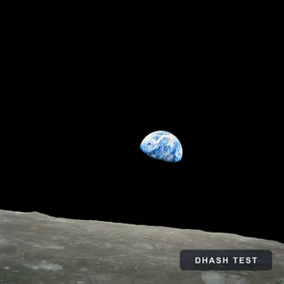
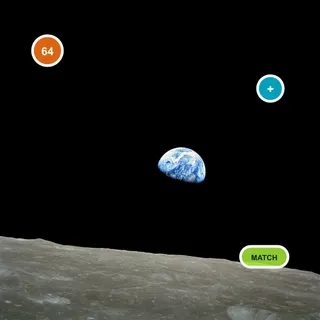

# dhash

Find near-duplicate images with a 64-bit difference hash.

`dhash` turns an image into a perceptual fingerprint, then compares two
fingerprints by Hamming distance. It can identify many resized, recompressed,
watermarked, and lightly edited variants without comparing the original files
byte-for-byte.

Runs in Bun, Node.js, and Deno through Sharp.

[](https://www.npmjs.com/package/@claudiu-ceia/dhash)
[](https://jsr.io/@claudiu-ceia/dhash)
[](https://github.com/ClaudiuCeia/dhash/actions/workflows/ci.yml)
[](./LICENSE)

[Try the live image comparison demo](https://dhash.claudiuceia.deno.net/)

<table>
  <thead>
    <tr>
      <th>Reference</th>
      <th>Watermark</th>
      <th>Stickers</th>
      <th>Heavy watermark</th>
      <th>Crop</th>
    </tr>
  </thead>
  <tbody>
    <tr>
      <td></td>
      <td></td>
      <td></td>
      <td></td>
      <td></td>
    </tr>
    <tr>
      <td>distance 0</td>
      <td>distance 2</td>
      <td>distance 9</td>
      <td>distance 15</td>
      <td>distance 22</td>
    </tr>
  </tbody>
</table>

These are distances from the checked-in test fixtures. Lower means fewer
differing hash bits. The crop shows an important limitation - dHash is not crop
invariant. The source is NASA's public-domain *Earthrise* photograph, and its
[provenance and generated edits](./docs/readme/README.md) are documented in the
repository.

## Install

npm:

```sh
npm install @claudiu-ceia/dhash
```

Bun:

```sh
bun add @claudiu-ceia/dhash
```

Deno:

```sh
deno add jsr:@claudiu-ceia/dhash
```

Import the npm package in Bun or Node.js:

```ts
import { compare, dhash } from "@claudiu-ceia/dhash";
```

Import the JSR package in Deno:

```ts
import { compare, dhash } from "jsr:@claudiu-ceia/dhash";
```

## Compare two images

```ts
import { compare, dhash } from "@claudiu-ceia/dhash";

const [reference, candidate] = await Promise.all([
  dhash("./reference.jpg"),
  dhash("./candidate.jpg"),
]);

const distance = compare(reference, candidate);

console.log({
  reference,
  candidate,
  distance,
});
```

`dhash()` returns a 16-character lowercase hexadecimal hash. `compare()` returns
the number of differing bits. For hashes produced by `dhash()`, the distance is
between `0` and `64`.

A distance of `0` means the two images produced the same perceptual fingerprint.
It does not mean their bytes are identical.

Runnable versions are in
[`examples/compare.ts`](https://github.com/ClaudiuCeia/dhash/blob/main/examples/compare.ts)
and
[`examples/readme.test.ts`](https://github.com/ClaudiuCeia/dhash/blob/main/examples/readme.test.ts).

## Hamming distance

A dHash contains 64 bits. `compare()` counts how many bits differ between two
hashes.

- `0` means the fingerprints are equal
- A lower value means more of the horizontal brightness structure is shared
- A higher value means more of that structure differs
- `64` is the maximum distance for hashes returned by `dhash()`

The distance is not a probability or percentage.

## Choosing a threshold

There is no universal duplicate threshold. The useful value depends on image
content, expected edits, preprocessing, and the cost of false matches.

Start with labelled examples from the application:

1. Collect pairs that should and should not match.
2. Compute their distances.
3. Choose a threshold that separates the two groups acceptably.
4. Keep reviewing values close to the threshold.

In this repository's fixture set, the small watermark produces a distance of
`2`, stickers produce `9`, the heavier watermark produces `15`, and the cropped
variant produces `22`. Those values describe these fixtures, not all images.

The application owns the policy:

```ts
const threshold = config.nearDuplicateDistance;
const likelyDuplicate = compare(reference, candidate) <= threshold;
```

## What dHash handles

dHash is intended for variants that preserve most of the image's horizontal
brightness structure, including many cases of:

- Resizing
- Recompression
- Format conversion
- Metadata changes
- Moderate overlays or watermarks
- Light edits

## What dHash does not handle

dHash is not designed for:

- Crops
- Translations
- Arbitrary rotation
- Major composition changes
- Semantic similarity between different images
- Exact byte equality
- File integrity or security checks

Use a cryptographic hash for byte equality or integrity. Use a model designed
for visual embeddings when different images with similar semantic content
should match.

`dhash()` applies EXIF orientation before hashing. That does not make the
algorithm invariant to arbitrary image rotation.

## Image normalization

Before computing the hash, `dhash()`:

1. Decodes the first image frame.
2. Applies EXIF orientation.
3. Composites transparency over white.
4. Converts the image to grayscale.
5. Resizes the complete image to `9x8` with no crop.
6. Compares each pixel with the pixel immediately to its right.
7. Encodes the resulting 64 bits as 16 lowercase hexadecimal characters.

The resize uses the full image and can change its aspect ratio.

The implementation follows the dHash approach described in Neal Krawetz's
[Kind of Like That](https://www.hackerfactor.com/blog/?/archives/529-Kind-of-Like-That.html).

## Inputs

```ts
dhash(source: string | Uint8Array, options?: DHashOptions): Promise<string>
```

- A string is treated as a filesystem path.
- `Uint8Array` contains encoded image bytes.
- Node.js `Buffer` works because it is a `Uint8Array`.
- URLs are not fetched automatically.
- Supported image formats depend on the installed Sharp build.
- Animated or multi-page input uses the first frame.

Fetch remote input separately, check the response, and pass the encoded bytes:

```ts
const response = await fetch(imageUrl);
if (!response.ok) {
  throw new Error(`Image request failed with ${response.status}`);
}

const bytes = new Uint8Array(await response.arrayBuffer());
const hash = await dhash(bytes);
```

See
[`examples/compare-bytes.ts`](https://github.com/ClaudiuCeia/dhash/blob/main/examples/compare-bytes.ts)
for a checked byte-input example. Treat remote image input as untrusted even
when resource limits are enabled.

## Interoperability

This implementation sets a bit to `1` when brightness increases from the left
pixel to the right pixel:

```text
left < right
```

Some implementations use the opposite convention. Use:

```ts
const compatible = await dhash(source, { invert: true });
```

or:

```ts
const compatible = invertHash(existingHash);
```

Compare hashes only when they use the same convention and preprocessing rules.
`compare()` requires equal textual hash lengths.

The normal output from `dhash()` is always 16 hexadecimal characters.

## Resource limits

`dhash()` limits both encoded and decoded input by default:

| Option | Default | Purpose |
| --- | ---: | --- |
| `maxInputBytes` | 64 MiB | Limits encoded bytes read from a path or passed directly |
| `limitInputPixels` | 64 megapixels | Limits the decoded image size passed to Sharp |

Either limit can be set to `false`:

```ts
await dhash(bytes, {
  maxInputBytes: false,
  limitInputPixels: false,
});
```

Disable a limit only when the caller applies an equivalent restriction. Path
input is read through the encoded-size bound instead of being read fully before
the size is checked.

## Limits and correctness

- dHash fingerprints are 64 bits, so collisions are expected.
- Equal hashes do not prove that files or decoded pixels are identical.
- The hash is not suitable for integrity, authentication, or security decisions.
- Cropping, translation, rotation, and larger edits can change the distance
  substantially.
- Thresholds must be selected against representative application data.
- Image decoding uses Sharp and should remain behind encoded-byte and
  decoded-pixel limits for untrusted input.

## API summary

### Hash and compare

```ts
dhash(source, options?);
compare(left, right);
```

```ts
type DHashOptions = {
  invert?: boolean;
  maxInputBytes?: number | false;
  limitInputPixels?: number | false;
};
```

### Interoperability

```ts
invertHash(hash);
```

### Inspect a hash

```ts
toAscii(hash, chars?);
raw(hash);
save(hash, filePath);
```

`raw()` returns PNG-encoded bytes for an 8x8 black-and-white rendering of the
hash. It does not return unencoded pixel bytes.

`save(hash, "./fingerprint")` writes `./fingerprint.png`.

Hash helpers accept 1 to 16 case-insensitive hexadecimal characters.

## Runtime support

The npm package is tested with:

- Bun `1.4.0` and the current Bun release on Linux
- Node.js `22`, `24`, and `26` on Linux
- Node.js `24` on macOS and Windows

The JSR package is checked with Deno `2.6.8` and the current Deno 2 release.

Bun is the primary development toolchain. The package uses Sharp for image
decoding and resizing, so it is a server-side package with a native dependency.

The browser demo uploads images to a server-side Deno Deploy application. The
`dhash` package itself does not run image decoding in the browser.

Sharp requires FFI and environment access in Deno. Path input also requires read
access, while `save()` requires write access. Grant only the paths and
permissions the application needs.

## Documentation

- [Live comparison demo](https://dhash.claudiuceia.deno.net/) for visual exploration
- [JSR API documentation](https://jsr.io/@claudiu-ceia/dhash/doc) for complete declarations and method comments
- [`src/dhash.ts`](https://github.com/ClaudiuCeia/dhash/blob/main/src/dhash.ts) for implementation details

## Development

Use Bun for the main contributor loop:

```sh
bun install
bun run check
bun run check:npm
```

Check Deno compatibility and preview the JSR package:

```sh
bun run check:deno
deno publish --dry-run
```

The TypeScript 7 native checker remains experimental and can be run with
`bun run check:ts7`.

## License

MIT © [Claudiu Ceia](https://github.com/ClaudiuCeia)
